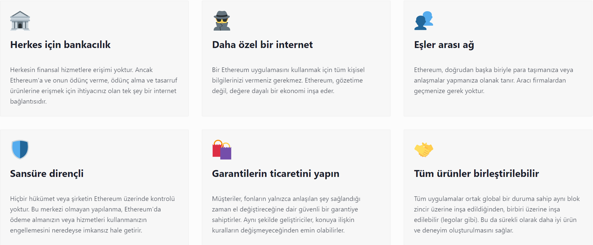

# Blockchain - WEEK 2

## **DAĞITIK DEFTER TEKNOLOJİSİ**

### Dağıtık defter teknolojisi (DLT) nedir?

Dağıtık defter teknolojisi (DLT); verilerin, bir ağ üzerinde bulunan birden fazla alanda erişilebilir, güncellenebilir, doğrulanabilir olmasına imkan sağlayan, merkeziyetsiz, teknolojik altyapıdır. Bir tür konsensüs mekanizması olarak tanımlanır.

Dağıtık defter teknolojisi (DLT), Bitcoin ile tanınan bir kavram olsa da geçmişi daha önceye dayanır. Merkezi olan yapılarda da dağıtık sistem kullanılır ancak güncelleme söz konusu olduğunda her yapı periyodik olarak güncellenir ve bu da hem gecikme yaratır hem de siber saldırılara karşı savunmasız bir ortam yaratır. Kriptografi bunun önüne geçerek, merkeziyetsiz ağda güvenilir şekilde işlenmesini sağlar ve bu ilk defa Bitcoin’de uygulanmıştır.

### DLT (Dağıtık Defter Teknolojisi) Nasıl Çalışır?

Dağıtık defter sisteminde, veriler parçalara ayrılır. Her parça, ağ katılımcısı olan kullanıcıların sunucularında saklanır. Bu verilere erişim, doğrulama ve güncelleme işlemleri ağ kullanıcıları tarafından gerçekleştirilir. DLT ile tüm veriler, kriptografi kullanılarak güvenli şekilde depolanır ve onlara sadece anahtar ile kriptografik imza kullanarak ulaşılabilir.

Dağıtık defter teknolojisini kullanan ilk kriptopara birimi Bitcoin’dir. Bitcoin blokzinciri, dağıtılmış defter teknolojisinin ilk işlevsel kullanımıdır.

### DLT (Dağıtık Defter Teknolojisi) Avantajları:

Dağıtık defter teknolojisinde verilerin tek bir merkezde olmaması ve ağda yer alan tüm düğümlerde tutulması, siber saldırılara karşı savunma gücünü yüksek tutar. Bu teknolojiye karşı bir siber saldırı uygulamak için dağıtılmış olan tüm defter kopyalarına saldırmak gerekir.

Ağa giren verilerin paylaşılması, güncellenmesi gibi işlemleri merkeziyeti olan sisteme göre çok daha hızlı ve ucuz şekilde gerçekleştirir.

## **PUBLIC & PRIVATE BLOCKZİNCİRLER**

Blok zinciri özünde, zincirdeki her kullanıcı arasındaki işlemleri kaydeden dağıtılmış bir defterdir. Genel olarak tek bir teknoloji olarak kabul edilse de, farklı blok zinciri türleri vardır: genel ve özel.

En iyi bilinen halka açık blok zincirleri, bitcoin işlemleri için kullanılanlar gibi kripto para birimleridir. Tamamen şeffaftırlar.

Bu tür bir platform, ticari sözleşmeler veya bireylerin kişisel bilgileri gibi hassas bilgilerle uğraşan kuruluşlara uygun olmayacaktır.

Özel kuruluşların, davet edilen kullanıcıların verileri herkese açık hale getirmeden işlem yapmasına izin veren özel bir blok zincirine katılma olasılığı daha yüksektir.

Özel blokajlar, kullanıcılar için farklı seviyelerde izinlere izin verir, böylece erişim kısıtlanabilir ve gizliliği korumak için bilgiler şifrelenebilir.

Blockchain teknolojisi, kullanıcıların ihtiyaçlarına göre uyarlanabilir.

### Private ve Public Blockchain Arasındaki Fark Nedir?

Blockchain, muhasebeden tarıma kadar birçok sektörde potansiyel uygulamalara sahiptir. Esasen, zincirdeki her kullanıcı arasındaki işlemleri kaydeden dağıtılmış bir defterdir.

Farklı blok zinciri türleri vardır: bazı zincirler publictir ve herkesin erişimine açıktır, bazıları private zincirlerdir ve yalnızca onları kullanma izni verilen kişiler tarafından erişilebilir.

Genel bir blockchain açık bir ağdır. Herkes protokolü indirebilir ve okuyabilir, yazabilir veya ağa katılabilir.

Halka açık bir blok zinciri dağıtılır ve merkezi değildir. İşlemler bloklar halinde kaydedilir ve bir zincir oluşturmak için birbirine bağlanır. Her yeni blok, blok zincirine yazılmadan önce, ağa bağlı düğümler olarak bilinen tüm bilgisayarlar tarafından zaman damgalanmalı ve doğrulanmalıdır.

Tüm işlemler herkese açıktır ve tüm düğümler eşittir. Bu, halka açık bir blok zincirinin değişmez olduğu anlamına gelir: doğrulandıktan sonra veriler değiştirilemez.

Kripto para birimi için kullanılan en iyi bilinen halka açık blok zincirleri Bitcoin ve Ethereum'dur: açık kaynaklı, akıllı sözleşme blok zincirleri.

Özel bir blok zinciri, tek bir varlık tarafından yönetilen, yalnızca davet edilen bir ağdır.

Ağa giriş yapanlar, blok zincirini okumak, yazmak veya denetlemek için izin gerektirir. Farklı erişim seviyeleri olabilir ve ticari gizliliği korumak için bilgiler şifrelenebilir.

Private zincirler, kuruluşların verileri herkese açık hale getirmeden dağıtılmış defter teknolojisi kullanmasına olanak tanır.

Ancak bu, blok zincirlerinin tanımlayıcı bir özelliğinden yoksun oldukları anlamına gelir: ademi merkeziyetçilik. Bazı eleştirmenler, özel blok zincirlerinin hiç blok zinciri olmadığını, ancak dağıtılmış defter teknolojisini kullanan merkezi veritabanları olduğunu iddia ediyor.

Private zincirler, işlemleri doğrulamak için çok fazla zaman ve enerji gerektiren public zincirlerden daha hızlı, daha verimli ve daha uygun maliyetlidir.

### Blok zincirleri ne kadar güvenli?

Özel bir blok zinciri, kullanıcıların bilgilere erişimini kontrol eder, ancak genel bir blok zincirinden daha az güvenlidir.

Halka açık bir blok zinciri tamamen şeffaf bir defterdir. Merkezi olmadığı için bilgiler şifrelenir ve birden fazla cihazda depolanır. Bu, halka açık bir blok zincirini hacklemeyi neredeyse imkansız hale getirir. Bir blockchain ne kadar çok üyeye sahipse, o kadar güvenlidir.

Özel bir blockchain ise sahibi tarafından değiştirilebilir. Ayrıca bilgisayar korsanlığına karşı daha savunmasızdır.

## **ŞİFRELEME**

Şifreleme Private Key and Public Key (Özel Anahtar- Genel Anahtar) prensibi ile çalışmaktadır.

Bu yöntem, “simetrik şifreleme yöntemi” olarak bilinen ve şifreleme ile şifre çözmenin aynı anahtar parola ile yapılması metodundan farklıdır.

Şifreleme metodunda, veri şifre sahibinin 2 adet anahtarı vardır. Bunlara Private Key and Public Key adı verilir.

Özel Anahtar ve Genel Anahtarı bana ait birbirlerinin aynı olan iki anahtar gibidir. Aralarındaki tek fark, Private Anahtarın sadece bizim bildiğimiz anahtar olmasıdır. Public Anahtar yine bize ait ama herkes ile paylaştığımız herkesin görebileceği bir anahtardır. Örnek verirsek Public key günlük hayatta kullandığımız sanal hesap numarası IBAN no diyebiliriz.Private key ise evimizin anahtarı olarak düşünebilirsiniz. Evinizin anahtarı olmadan özel alanınızda hiçbir faaliyet göstermezsiniz.

Bu sistem sayesinde dijital varlıkların herhangi bir aracıya ihtiyacı olmaksızın güvenli bir şekilde bir taraftan öbürüne taşınması sağlanıyor.

### Digital Signature

Dijital imza, kriptografik tekniklere dayalı elektronik imza olarak tanımlanabilir. Başka bir ifade ile dijital ortamda gönderilen verinin kaynağı ve özgünlüğü dijital imzalar aracılığıyla kanıtlanmaktadır. Dijital imzalar söz konusu doğrulamaları gerçekleştirmek için hash ve asimetrik şifreleme yöntemi gibi kriptografik yöntemlerden yararlanır.

Kriptografik özet ya da hash, rastgele uzunluktaki bir girdiyi sabit uzunlukta şifrelenmiş bir çıktıya dönüştüren matematiksel bir algoritmadır. SHA-256 fonksiyonu da bu amaçla en fazla kullanılan matematiksel algoritmalardan biridir. SHA-256 algoritmasıyla şifrelenen her veri, girdinin boyutundan bağımsız olarak 64 karaktere veya 256 bit’lik bir boyuta indirgenmektedir.

## **AKILLI KONTRATLAR**

Bir an için akıllı sözleşmeyi ve blockchain'i unutun. Genel olarak sözleşmeleri düşünün. Bunlar, bazı işlemlerin (örneğin; para değişimi) gerçekleşmesi için yerine getirilmesi gereken bazı koşulları içerir. Örneğin, bana bir dizüstü bilgisayar satıyorsanız, yalnızca dizüstü bilgisayarın düzgün çalışması durumunda size ödeme yapmaktan sorumlu olacağımı belirten bir sözleşme yer alacaktır. Benzer şekilde, akıllı sözleşmeler, işlemlerin bir blok zincirinde gerçekleşmesi için yerine getirilmesi gereken ön koşuldur.

Akıllı sözleşme, diğer sözleşmelerde olduğu gibi, bir anlaşmanın koşullarını belirler. Ama geleneksel bir sözleşmenin aksine, akıllı sözleşmenin koşulları Ethereum gibi bir blok zincirinin üzerinde çalışan kodlar şeklinde yürütülür. Akıllı sözleşmeler, kredi ve sigortadan lojistik ve oyunlara kadar çok yönlü eşler arası işlev sunarak geliştiricilerin blok zincirinin sunduğu güvenlik, güvenilirlik ve erişilebilirlikten faydalanan uygulamalar oluşturmasına olanak tanır.

## **MAHREMİYET**

---

## **KRİPTO PARALAR**

Kripto para veya kısaca kripto, bir değişim aracı olarak çalışmak üzere, işlemleri güvence altına almak için matematiğin bir dalı olan kriptografi kullanılarak tasarlanmış bir dijital unsurdur. Kripto paralar bir nevi dijital döviz, alternatif döviz ve sanal dövizdir. Kripto varlıklar, merkezi elektronik para ve merkezi bankacılık sistemlerin aksine tümüyle merkeziyetsizlerdir. Her bir kripto para biriminin merkeziyetsizliği, umumi işlem veri tabanı olan dağıtık muhasebe defteri (ledger) olarak işlev gören bir blok zincirinden (Blockchain) gelmektedir.

2009’da Satoshi Nakamoto tarafından oluşturulan Bitcoin, ilk merkeziyetsiz kripto paradır.[7] O zamandan beri birçok farklı kripto para ortaya çıkmıştır. Bitcoin dışındaki kripto para birimlerine genel olarak altcoin denilir ki bu kısaltma alternatif ve coin yani madeni para’nın birleşimidir.

### TOKEN NEDİR?

Kripto paralar içinde sıklıkla duyduğumuz token'lar aslında birer dijital varlık ve her birinin birim değerleri var.
Bu değerler, onları belli oranlarda alım satıma açık hale getiriyor. Aynı zamanda token'lar oluşturuldukları platformun tüm yönlerinden yararlanmanıza olanak veren transfer edilebilen dijital mülkler olarak da tanımlanmakta. Aslında token üretiminin amacı, yer aldıkları platformun sürekliliğini sağlamak ve kalitesini yükseltmektir. Zira bir token'ın değer, belli bir ürünü ya da hizmeti temsil ediyor olabilir. Örneğin token'ı üreten bir teknoloji firmasıysa bu durumda token'ın değeri, o şirketin yazılım hizmetinin yıllık lisansı olabilir. Diğer yandan söz konusu tekstil markasıysa o token, bir bluz ya da elbise olabilir. Hatta token üretimleri kişi bazlı bile olabilir ve saatlik iş gücü olarak değerlenir. Örnekleri bu şekilde artırmak mümkün. Burada altı çizilmek istenen konu, her token'ın belli bir ürün ya da hizmete dönüştürülebileceğidir.

### COIN NEDİR?

Coin'ler, belli bir kriptoloji kullanılarak yaratılıyor. Bu şifreleme sistemi içinde kendilerine ait bir de blok zincire sahip olan coin çeşitleri, zaman içinde değer depolayarak paraya eşdeğer bir dijital unsur halini alıyor. Coin'lerin dayandığı dijital defter olan ve Blockchain olarak adlandırılan bu blok zincirlerde, veriler toplu olarak saklanmakta. Ayrıca bu zincirde, dolandırıcılığı engellemek amacıyla şeffaflık hakim. Bir coin üretmek için öncelikle bir blok zincir yaratmak gerekiyor. Zira coin'ler, var olan blok zincirler üzerine değil, yeni zincirler oluşturularak yaratılıyor.

### FARKLARI

Token ve coin. Bu iki dijital unsur hem oluşturuluş biçimleri hem de kullanım yönleri olarak birbirinden ayrışıyor.

- Dijital bir para olan coin ile para satın alınabilirken token ile bir ürün ya da hizmet satın alınabiliyor.
- Bir coin üretmek için öncelikle bir blok zincir yaratmak gerekiyor. Token ise coin'den farklı olarak bir dijital varlık şeklinde tanımlanmakta. Üstelik yaratılması da coin'e kıyasla çok daha kolay. Zira token üretmek için kriptoloji bilmenize gerek yok. Farklı projeler vasıtasıyla üretilen token çeşitleri, ödeme yöntemi olarak da kullanılabiliyor.
- Token ile coin arasındaki en bariz fark, sahibine ağa katılma hakkı vermesi. Token oluşturmak için birkaç basit adımı takip etmek yeterli. Bunun için size yardımcı olacak platformlardan destek alarak kolaylıkla token'ını kendi oluşturabilirsin. Tek ihtiyacın olan blok zinciri tabanlı standart bir şablon kullanmak. Bu şablonlar, kullanıcının farklı belirteçleri tek bir cüzdanda saklaması için zemin hazırlıyor.
  > Gökşen

---

## **Blockchain Uygulama Alanları**

Blockchain, sadece kripto para ekosisteminin temelini oluşturmakla kalmayıp, birçok alanda kendini göstermeye başlamıştır. Bu alanda en çok ilgi kripto alanında olsa da, blockchain birçok farklı soruna çözüm bulan bir teknolojidir.

1. ### Bankacılık ve Finans

   Blockchain, ağ üzerinde gerçekleşen tüm işlemleri takip etmeye imkân veren saydamlık, üretilen verilerin üzerinde işlem yapılmasını engelleyen değiştirilmezlik ve güvenli veri saklama özellikleri sayesinde, bankacılık ve finans alanı için oldukça kullanışlı ve güvenli bir çalışma alanı yaratmaktadır.

   Aynı zamanda ticari anlaşmalarını düzenleme ve sınırlar arasındaki süreci kolaylaştırma yeteneğine sahiptir. İşletmelerin birbirleriyle bölgesel veya coğrafi sınırların ötesinde daha kolay işlem yapmalarını sağlamaktadır.

   Blockchain’in son derece güvenli yapısı, insan hatası olasılığını önemli ölçüde azalttığı ve kayıtların bütünlüğünü sağladığı için muhasebe ve denetim alanlarında oldukça kullanışlı bir çalışma sağlamaktadır. Bunun da ötesinde, blockchain altyapısı ile kayıt altına alınan veriler hiçbir kişi ya da kuruluş tarafından değiştirilememektedir.

2. ### Sağlık

   Teknoloji geliştikçe, sağlık sektöründe tıbbi cihazların kullanımı artmaya başlamıştır. Blockchain teknolojisi sayesinde, tıbbi cihazlar elde ettikleri verileri benzersiz şekilde kayıt altına alabilme ve her hastanın tıbbi geçmişini arşivleyebilme imkanı sunmaktadır. Daha önce de bahsettiğimiz üzere, arşivlenen bu kayıtlar üst düzey güvenlik içerisinde korunacak ve hasta gizliliği kolayca sağlanacaktır. Sağlık hizmetlerine blockchain teknolojisinin entegre edilmesine bir örnek olarak, Kıbrıs’ta bir hastane, COVID-19 aşılarını doğrulamak için blokzincir tabanlı bir mobil uygulama kullanmıştır. E-Chert isimli uygulama ile aşı sertifikaları VeChain’in, “VeChainThor” blockchain’i üzerinden doğrulanmıştır.

3. ### Savunma Sanayi

   Blockchain teknolojisinin askeri alanda kullanabileceği yerlerin başında gizli ve kritik bilgilerin depolanması ve korunması gelmektedir. Blockchain, gizli verilerin dağıtık ve şifreli bir şekilde saklanmasına imkân sağlamaktadır. Bu şekilde merkezi sistemlerde sıklıkla rastlanan siber saldırı ihtimali de azaltılmaktadır.

4. ### IoT

   Internet of Things (IoT), var olan her nesnenin internet erişimi sayesinde diğer cihazlar ile iletişim kurmasını sağlayan bir teknolojidir. Blockchain ve IoT teknolojisi birlikte çalıştıklarında;

   - **Tedarik Zinciri:** Malların sevk edildikleri sırada yerlerinin takip edilmesi ve belirlenen şartlar dahilinde kalmasının sağlanması.
   - **Varlık takibi:** Bulut çözümlerine alternatif olarak faaliyet ve çıktıları kaydetmek için varlıklar ve makinelerin izlenmesi gibi imkanlar sağlayabilmektedir.

5. ### Eğitim

   Blockchain teknolojisinin sağladığı faydaların eğitim alanında da kullanılabileceği birçok araştırmacı tarafından öngörülmektedir. Yaşam boyu öğrenme fırsatlarını artırmak, akıllı sözleşmeler yoluyla eğitimciler için daha fazla verimlilik sağlamak ve diğer faydaların yanı sıra öğrencilere akademik kayıtlarının blockchain üzerinde saklaması bu faydalar arasında sayılmaktadır. Teknoloji gelişmeye devam ettikçe, blockchain’in eğitim alanında daha büyük bir rol oynaması muhtemel olacaktır.

   Öğrenci kayıtlarının sayısı neredeyse sonsuzdur. Çok sayıda kağıt doküman ve akademik kimlik bilgilerini doğrulamak zaman alıcı olabilmektedir. “Credential Engine” tarafından 2019 yılında gerçekleştirilen analize göre notlar, sertifikalar, dijital rozetler dahil olmak üzere öğrenimi belgeleyen 738.000’den fazla benzersiz kimlik bilgisi bulunmaktadır. Tüm bu veriler blockchain teknolojisi ile güvenli bir şekilde saklanabilmektedir.

## **ETHEREUM**

2015'te piyasaya sürülen Ethereum, Bitcoin'in inovasyonu üzerine bazı büyük farklılıklarla birlikte inşaa edilmektedir.

Her ikisi de dijital paraları ödeme sağlayıcıları veya bankalar olmadan kullanmanızı sağlar. Ancak Ethereum programlanabilirdir, böylece ağında merkeziyetsiz uygulamalar inşaa edip dağıtabilirsiniz.

Ethereum programlanabilir olduğundan, veri depolamak veya uygulamanızın neler yapabileceğini kontrol etmek için blok zincir kullanan uygulamalar oluşturabilirsiniz. Sonuç olarak Ethereum ağında gerçekleşecek harika bir yenilik olan sınırsız her şeyi yapmak için programlanabilen genel amaçlı bir blok zincirdir.

Bitcoin sadece bir ödeme ağı iken Ethereum daha çok finansal servisler, oyunlar, sosyal ağlar ve gizliliğinize saygı duyan ve sizi sansürleyemeyen diğer uygulamalardan oluşan bir pazar yeri gibidir.

## **POW vs POS**

### **POW (Proof of Work)**

PoW konsensüsü, ağda yayınlanacak olan bir sonraki bloğu oluşturmak adına, belli bir eşiğin (nonce) altında olan bir değer karşılığında matematiksel bulmacaları çözmeye dayanır. Sonraki bloku oluşturan blok liderleri loto benzeri bir formatla seçilir. Bu seçim, madencilerin işlemi gerçekleştirmek için katkıda bulundukları işlem (hash) gücüne doğrudan bağlıdır. Satoshi Nakamoto’nun Bitcoin whitepaper’ında açıkladığı üzere:

- İş İspatı, çoğunluğu temel alan karar mekanizmasında temsilcilerin belirlenmesi problemini de çözüyor. Çoğunluğu oluşturmak için her IP adresi başına bir oy prensibi benimsenmiş olsaydı çok sayıda IP adresi edinebilecek herkes kendi başına çoğunluğu oluşturabilirdi. İş İspatı mekanizmasının temelinde ise her CPU başına bir oy prensibi bulunuyor. Çoğunluk kararını temsil eden en uzun zincir, aynı zamanda, en fazla İş İspatı çabasını sağlamış olan zincir. CPU gücünün çoğunluğu dürüst node’lar tarafından kontrol edilirse bu dürüst zincir, en hızlı büyüyen zincir olacaktır ve rakiplerinin önüne geçecektir.

**POW'a bakarken madencilere de değinmezsek olmaz;**

Bitcoin özelinde madenciler, her 10 dakikada bir oluşturulan yeni blokları üretmek ve ağa yayınlamak için birbirleriyle rekabet eden bir katılımcı piyasasıdır. Her 10 dakikalık raundun sonunda kazanan madenci hem blok ödülünü (an itibarıyla 6,25 BTC) hem de bloktaki işlem ücretlerini alır. Bu sistem, iki sebepten dolayı madencilerin blok üretiminde dürüst davranmalarını teşvik eder.

İlk olarak madenciler, Bitcoin’in madencilik algoritmasını çözmek için pahalı donanım ekipmanlara yüksek miktarlarda yatırım yaparlar. Bu sayede, işlem gücünü sürekli olarak kullanıp tabiri caizse kaba kuvvetle çözümü bulmaya çalışırlar ve bunun için yüksek miktarda elektrik enerjisi tüketirler.

Madenciler kötü niyetli davranır ve madencilik sürecini çökertmeye çalışırlarsa hem Bitcoin’in itibarına zarar veriler hem de donanımlarına yaptıkları yatırımın maliyeti artar. Bunun sebebi, blok ödülü olarak kazandıkları BTC’lerden yatırım getirilerinin (ROI) düşecek olmasıdır ve bu da ikinci sebebi ortaya çıkarır.

Madenciler blok ödüllerini nakit olarak değil, doğrudan BTC olarak alırlar. Bunun sonucunda, gerçek dünyadaki bir kaynak olan elektrik enerjisini BTC üretimine harcarlar ve Bitcoin’in güvenlik modelinin temelindeki, sahtesi oluşturulamayacak değer üretimini desteklerler. Dahası, madenciler BTC üretiminde sade bir itibari parayı (donanım ekipman formunda) değil, gerçek bir kaynağı dönüştürdükleri için blok zinciri de gerçek hayatta geçerli olan bir tür değer kazanmış olur.

### **POS (Proof of Stake)**

Hisse ispatı, (PoS) bir kripto para blok zinciri ağının dağıtık fikir birliğine ulaşmayı amaçladığı bir algoritma türüdür. PoS tabanlı kripto para birimlerinde, bir sonraki bloğu oluşturan, rassal seçim ve zenginliğin (yani, hissenin) çeşitli kombinasyonları yoluyla seçilir. Aksine, bitcoin gibi emek ispatına dayanan kripto paraların algoritması, madencilik kullanır. Yani, kayıtları (transaction) doğrulamak ve yeni bloklar oluşturmak için yoğun hesaplamalı bulmacaların çözümünü gerektirir.

## **NODE**

Bitcoin ağı, dağıtık ve eşten eşe bir sistemden oluşur. Bu sistem içerisinde node (düğüm), blokzinciri üzerinde gerçekleşen işlemlerin kopyalarını tutan cihazlara verilen isimdir. Node ismini alan cihazlar, Bitcoin işleminin gerçekleştirildiği herhangi bir bilgisayar veya aygıt olabilir. Diğer bir deyişle node, Bitcoin ağı üzerindeki iletişim noktalarıdır. Node’lar, blokzincirinin bütünlüğünü korumayı hedefler. Node’lar aracılığıyla, dışarıdan gelebilecek herhangi bir müdahaleye karşı blokların geçmişi korunmaktadır.

Node’lar blokzinciri üzerindeki düğüm, yani bağlantı noktalarıdır. Bu noktalar işlemlerin gerçekleştirildiği cihazlardır ve node’lar üzerinde blokzinciri üzerindeki işlemlerin kopyaları saklanır. Blokzinciri üzerinde gerçekleşen tüm işlemlerin kaydedilmesi, kriptopara işlemlerinin güvenle yapılmasını sağlayan temel unsurlardan biridir. Bu noktada, node bu işlevin gerçekleşmesini sağlayan ögedir.

### Node Türleri

- **Full Node**
  Full Node, 2009 yılından bu yana blokzinciri üzerinde gerçekleşen tüm işlemlerin tutulduğu düğüm çeşididir. Full node’lar, aynı zamanda, eklenen yeni blokların doğrulanmasını sağlamaktadır.
- **Light Node**
  Light Node, belirli bir dönem içerisinde blokzinciri üzerinde gerçekleşen işlemlerin kopyalarının tutulduğu düğüm çeşidine verilen isimdir. Full node’dan farklı olarak tüm geçmişi tutmak yerine, bağlı olduğu önceki bloğa ilişkin bilgileri içermektedir.
- **Authority Node**
  Authority node, Proof of Authority protokolüyle yakından ilişkili bir kavramdır. Proof of Authority yani Yetki İspatı, blokzincirindeki işlem bloklarını doğrulayan kullanıcılar işlemleri doğrulamak için kimlik ve itibarlarını kullandıkları protokole verilen isimdir. Authority Node’lar ise bu Yetki İspatı sistemi içerisinde yeni blokların doğrulanması için kullanılır.
